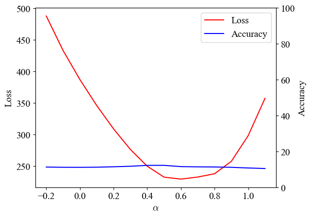
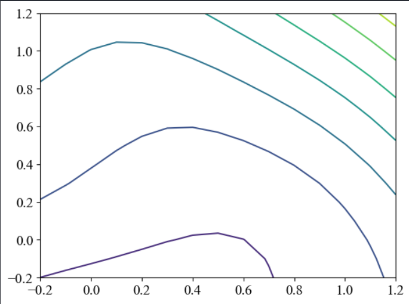
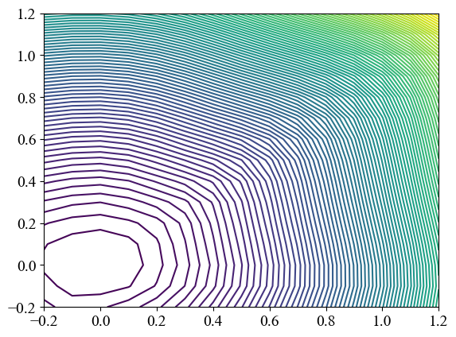
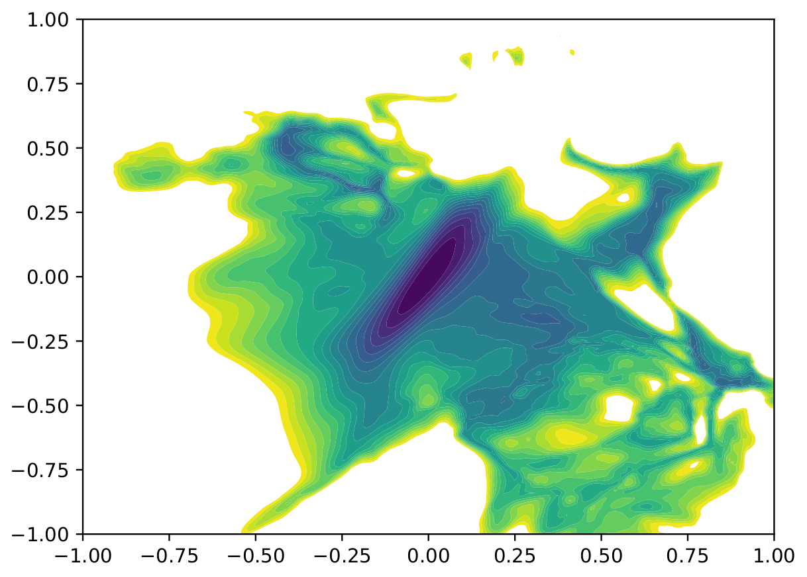

# CSCI-653: Final Project -- Visualizing Loss Landscape

  
  

While training neural nets, the loss function is a function of the model architecture, the optimisation method, initialisation, etc. Yet, the effect of these choices on the resulting objective is unclear. We visualise loss function convergence to gain insights into the training. Visualisation of landscapes offers richer insights and helps explain why neural nets can optimise even extremely complex non-convex functions and why the minimum optimised generalises well.
Given a network architecture and its pre-trained parameters, we calculate and visualize the loss surface along random direction near the optimal parameters. 

## Visualizing 1D loss curve

The 1D linear interpolation method evaluates the loss values along the direction between two minimizers of the same network loss function. This method has been used to compare the flatness of minimizers trained with different batch sizes. A 1D linear interpolation plot would look something like this:

  

## Visualizing 2D loss contours

To plot the loss contours, we choose two random directions with the same dimension as the model parameters and normalize them. A 2D loss contour would look like this:

  

## Things to try

1. Instead of generating random directions from simple Gaussian distribution, use QR decomposition and orthogonalize the directions.

2. Perturb the weights in their first principle directions.

3. There are some cases where even sharp minima can generalize well for deep neural networks [“Sharp Minima Can Generalize For Deep Nets”](https://arxiv.org/pdf/1703.04933.pdf)

4. Parallelize the process of computing loss surface values using MPI (or maybe offload it to GPU)

5. Does this scheme work for a wide range of networks?

## Main question -- Does it really give a correct picture of sharpness/flatness of the minima.

To answer this question I plotted the loss landscape of a simple ANN with 1 hidden layer to classify the cifa10 dataset. As expected the model didn't give good accuracy of predictions, however, its loss landscape (All in 1D, 2D and filter normalized 2D) gave very flat convex minima with nice "bowl" shape as shown in the below figures. 

  

  

  

This scheme of loss landscape plotting seems to work for more complicated model. I tried plotting the landscape for VGG16 and it gave the following expected results of having non-convex sharp minima as shown in the figure below

  

Thus, from my early analysis it looks like this method works only if you use a very deep neural network (with 15+ hidden) layers for this method to classify whether the model will work well or not. Futher, if this method is used for these deep neural networks, computational time required to even compute the loss of different weight vectors is extremely high. I looked into parallelizing these computations to obtain faster results, but it seems unlikely to get performance benefit if you are using a single machine, because tensorflow library itself uses all the computational resources available on a node. Thus, the only way in which we can obtain speedup is if we have separate computing nodes and use MPI for the data exchange.

## Reference

[1] Hao Li, Zheng Xu, Gavin Taylor, Christoph Studer and Tom Goldstein. [*Visualizing the Loss Landscape of Neural Nets*](https://arxiv.org/abs/1712.09913). NIPS, 2018.

[2] tomgoldstein/loss-landscape. (2020). GitHub. Retrieved December 2, 2022, from [https://github.com/tomgoldstein/loss-landscape](https://github.com/tomgoldstein/loss-landscape)